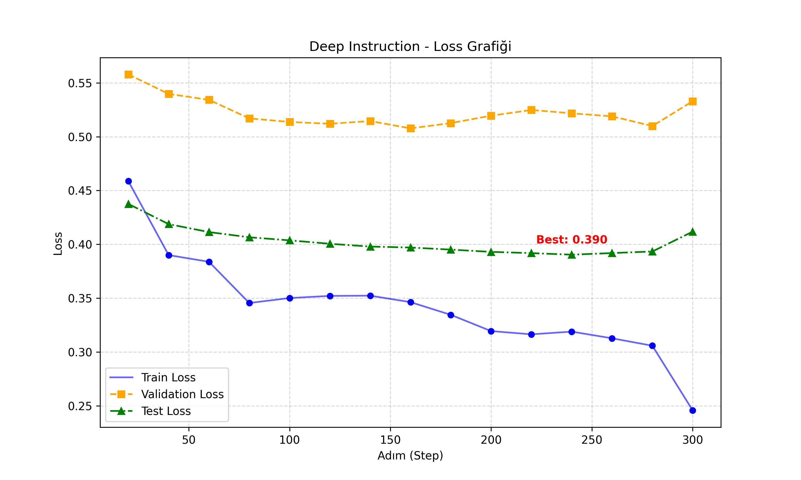
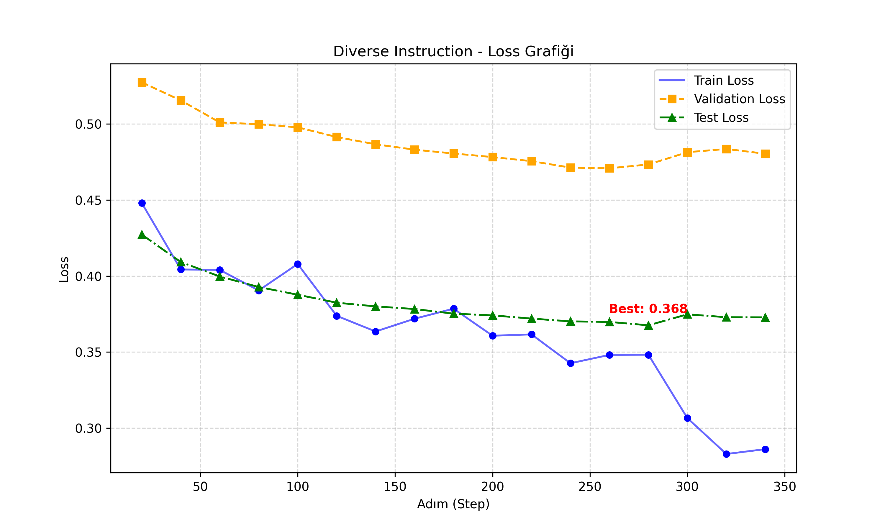

# Qwen2.5-Coder LoRA Fine-Tuning Project 🚀

This repository contains the implementation of a LoRA (Low-Rank Adaptation) fine-tuning project for the **Qwen2.5-Coder-1.5B-Instruct** model. The goal of this project is to enhance the code generation capabilities of the base model using two different dataset strategies: **Deep Instruction** (Chain-of-Thought) and **Diverse Instruction**.

This project was conducted as part of the **CEN445 - Introduction to Data Visualization** course.

## 🛠️ Environment & Hardware

- **Platform:** Google Colab Pro
- **GPU:** NVIDIA A100 (40GB)
- **Training Method:** LoRA (PEFT)
- **Precision:** `bfloat16` (Brain Floating Point)

## 📂 Repository Structure

### 🔹 Code & Configuration
- `train_deep.py`: Training script for the Deep Instruction dataset.
- `train_diverse.py`: Training script for the Diverse Instruction dataset.
- `livecodebench_eval.py`: Evaluation script adapted from LiveCodeBench.
- `requirements.txt`: Dependencies required to run the project.

### 🔹 Data & Logs (Evidence)
- `deep_training_log.csv`: Raw training logs (Loss values) for Deep Instruction model.
- `diverse_training_log.csv`: Raw training logs (Loss values) for Diverse Instruction model.
- `final_results`: **Full evaluation outputs.** This directory contains:
    - Generated Python codes for all 41 problems.
    - Detailed JSONL logs for every test case.
    - Summary JSON files with Pass@1 scores.

### 🔹 Visual Analysis
- `deeplossfinal.png`: Loss analysis graph for the Deep Instruction model.
- `diverselossfinal.png`: Loss analysis graph for the Diverse Instruction model.

## ⚠️ Implementation Details & Modifications

To adapt the project to the Colab environment and specific hardware constraints, the following modifications were made:

1.  **Google Drive Integration:**
    The training scripts are configured to save checkpoints directly to Google Drive (`/content/drive/MyDrive/...`) to ensure data persistence during long training sessions.

2.  **Flash Attention Adjustment:**
    Although trained on an A100 GPU, we encountered library compatibility issues with Flash Attention 2 during the inference/evaluation phase. Therefore, the `use_flash_attention_2=True` argument was removed from `livecodebench_eval.py`. The evaluation runs in standard `bfloat16` mode.

## 📊 Benchmark Results (Pass@1)

We evaluated the models using the **LiveCodeBench (AtCoder - Easy)** dataset consisting of 41 coding problems. Detailed evaluation data is available in the `results/` directory.

| Model | Best Checkpoint | Pass@1 Score | Problems Solved |
| :--- | :--- | :--- | :--- |
| **Base Model (Qwen2.5-Coder)** | - | **26.83%** | 11 / 41 |
| **Deep Instruction (Ours)** | **Step-200** | **34.15%** 🏆 | **14 / 41** |
| **Diverse Instruction** | Step-200 | **29.27%** | 12 / 41 |

**Conclusion:**
The **Deep Instruction** model significantly outperformed both the Base model (+7.3%) and the Diverse Instruction model. This demonstrates that training with Chain-of-Thought (CoT) data is more effective for reasoning-based coding tasks than simply increasing data diversity.

## 📈 Training Analysis & Overfitting

We monitored Train, Validation, and Test losses throughout the training process. The raw data for these graphs is available in the `.csv` log files.

### 1. Deep Instruction Model


### 2. Diverse Instruction Model


### 🔍 Analysis
In both training sessions, the **Validation Loss reached its minimum around Step 200**. As training continued to Step 300, the validation loss began to increase or plateau, and the benchmark performance dropped (e.g., Deep model dropped from 34.1% to 24.4%). This clearly indicates that **overfitting** started occurring after Step 200. Therefore, **Step 200** was selected as the optimal checkpoint.

## 🚀 How to Reproduce Results

To install the necessary libraries:
```bash
pip install -r requirements.txt
